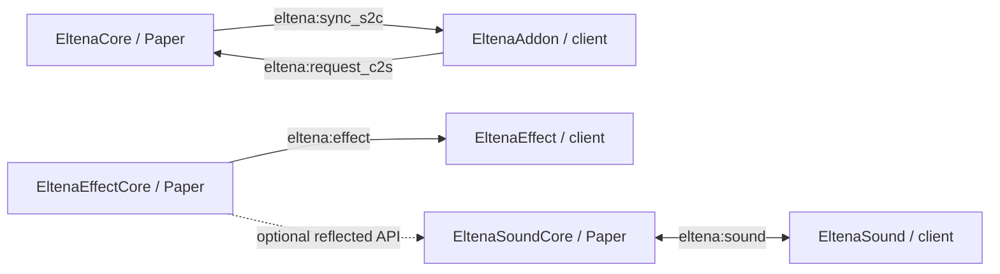

# 構成と依存関係

1リポジトリ・6つの独立Gradleプロジェクトを採用した公開準備案です。
ペア間のプロトコル変更、責務の説明、設定例を同じ変更としてレビューできます。
独立したビルド定義を維持し、将来ペア単位で分割する余地も残しています。

6本の間にGradleのproject依存はありません。通信チャンネルや、SoundCore APIのリフレクション連携による実行時の関係があります。
これらのチャンネル文字列、Mod ID、プラグイン名、設定キー、保存先のキーは公開準備で変更していません。

| モジュール | ビルド時の直接依存 | 実行時の補足 |
| --- | --- | --- |
| EltenaCore | Paper API 1.21.1、PlaceholderAPI 2.11.6、別途入手するMythicMobs 5.12.0 | MMOItems/MythicLibを反射で参照する箇所、MobHPの任意連携が残る。対象外プラグインは同梱しない |
| EltenaEffectCore | Paper API 1.21.1、Gson 2.11.0 | SoundCoreへの任意連携。MythicMobs向けコマンド入口あり |
| EltenaSoundCore | Paper API 1.21.1、Gson 2.11.0 | 音声定義、ライブ音声の転送・キャッシュ・再生 |
| クライアント3本 | Minecraft 1.21.1、NeoForge 21.1.228、Parchment 2024.11.17 | ModDev Gradle 2.0.78。サーバー側の判定正本を持たない |

成長の現行方針はHP/MP、装備連携の中心はMMOItemsです。過去の型・表示例がソース中に残っていても、STR/DEX/INT成長や魔法の採用を意味しません。
魔法は現行実装済み機能として案内しません。

ライブアセットの実装済み範囲はゲーム中の音声転送・再生です。画像・モデル・フォントなど音声以外の転送・更新は実装していません。音声の具体的な転送方式・キャッシュ・操作と未実装範囲は [音声実装資料](SOUND_IMPLEMENTATION.md) を参照してください。
